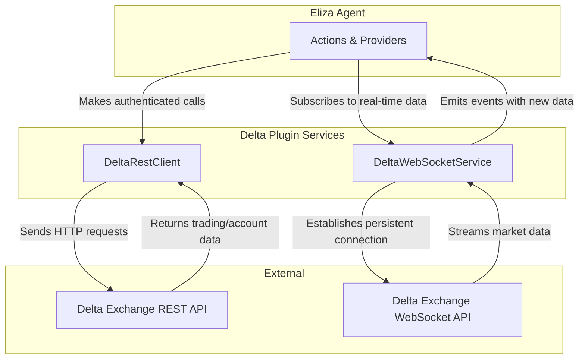

# Eliza OS Delta Exchange Plugin

A comprehensive trading plugin for Eliza OS that provides a complete interface for interacting with the Delta Exchange, including real-time data, order management, and advanced trading features.

## Overview

This plugin equips an Eliza OS agent with the capabilities of a sophisticated trading bot on the Delta Exchange. It includes a robust REST client for all trading and account actions, as well as a WebSocket service for real-time market data streams. The plugin is designed to be highly configurable and extensible, allowing developers to build complex, automated trading strategies.

## Installation

To add the Delta Exchange plugin to your Eliza OS agent, run the following command:

```bash
elizaos plugins add @your-npm-username/plugin-delta
```

Then, add the plugin to your character file's `plugins` array:

```typescript
// src/character.ts
import { Character } from '@elizaos/core';

const character: Character = {
  // ... other character properties
  plugins: [
    // ... other plugins
    "@elizaos/plugin-delta" // Add the delta plugin here
  ],
  // ...
};

export default character;
```

## Configuration

The plugin requires API credentials for authentication. These can be set in your `.env` file or directly in your character configuration.

| Variable | Description | Default |
| --- | --- | --- |
| `apiKey` | Your Delta Exchange API key. | ` ` |
| `apiSecret` | Your Delta Exchange API secret. | ` ` |

Additional trading and risk management parameters can also be configured. See `src/config/schema.ts` for a complete list of options.

## Features

- **Complete API Coverage:** Implements all major REST endpoints for trading, account management, and market data.
- **Real-Time Data:** Includes a WebSocket service for live ticker, order book, and position updates.
- **Robust Error Handling:** Provides detailed error messages for failed API requests and trading actions.
- **Configurable Risk Management:** Includes evaluators to monitor execution health and enforce risk parameters.

## Security Features

This plugin is designed with security as a top priority. Here are the key security measures in place:

-   **HMAC-SHA256 Authentication:** Every private request to the Delta Exchange API is signed using a secure HMAC-SHA256 signature. This ensures that all communication is authenticated and protected from tampering.
-   **Configuration Validation:** The plugin uses a strict Zod schema to validate all configuration settings at startup. This prevents the agent from running with invalid or missing API credentials, which could lead to security risks or unexpected behavior.

## Actions

Actions are the core commands that allow the agent to interact with the Delta Exchange. Each action is a self-contained unit of functionality that can be triggered by the agent in response to user input or other events.

### Market Data Actions
-   **`get-products`**: Fetches a list of all tradable products.
-   **`get-ticker`**: Retrieves the latest price ticker for a specific symbol.
-   **`get-orderbook`**: Gets the current order book for a product.
-   **`get-option-chain`**: Fetches the entire option chain for an underlying asset.

### Order Management Actions
-   **`place-order`**: Creates a new market or limit order.
-   **`edit-order`**: Modifies an existing open order.
-   **`cancel-order`**: Cancels a specific open order by its ID.
-   **`cancel-all-orders`**: Cancels all open orders, optionally for a specific product.

### Account & Position Management
-   **`get-positions`**: Retrieves all open positions for the account.
-   **`get-margins`**: Fetches the current margin and balance information.
-   **`set-order-leverage`**: Adjusts the leverage for a specific product.
-   **`close-all`**: Closes all open positions.

### Advanced Trading Features
-   **`create-deadman`**: Creates a deadman's switch (heartbeat) for automated safety.
-   **`ack-deadman`**: Acknowledges (pings) an active deadman's switch.
-   **`get-deadman-status`**: Checks the status of a deadman's switch.
-   **`update-mmp`**: Updates the Market Maker Protection (MMP) configuration.
-   **`reset-mmp`**: Resets the MMP configuration to its default state.

## Service Architecture

The plugin's architecture is designed for a clear separation of concerns, ensuring that real-time data handling and transactional operations are managed independently. This is achieved through two primary services that work in tandem.



### 1. `DeltaRestClient` (Transactional Operations)

This service is the workhorse for all authenticated, request-response interactions with the Delta Exchange. It is responsible for:

-   **Authenticated Requests:** Securely signing all private requests with your API key and secret using the required HMAC-SHA256 algorithm.
-   **Trading Actions:** Sending requests to place, edit, and cancel orders.
-   **Account Management:** Fetching account data such as positions, margins, and balances.
-   **Error Handling:** Intelligently handling API errors, including rate limits, and providing clear feedback.

### 2. `DeltaWebSocketService` (Real-Time Data)

This service manages the persistent, real-time connection to the Delta Exchange's WebSocket API. Its key responsibilities include:

-   **Live Market Data:** Subscribing to and receiving live data streams for tickers, order books, and market trades.
-   **Real-Time Account Updates:** Listening for updates on your orders and positions as they happen.
-   **Connection Management:** Automatically handling the WebSocket connection lifecycle, including authentication and reconnection in case of network interruptions.
-   **Event Emission:** Emitting structured events within the Eliza OS agent whenever new data is received, allowing other components to react in real-time.

## Important Notes

- **Test with Small Amounts:** When using this plugin for live trading, always start with small amounts to verify your strategies and configuration.
- **API Key Security:** Never expose your API secret in client-side code or public repositories. Use environment variables or a secure secret management system.

## Resources

- **Delta Exchange API Documentation:** [https://docs.delta.exchange/](https://docs.delta.exchange/)

## License

This project is licensed under the terms of the MIT license. See the [LICENSE](LICENSE) file for details.
